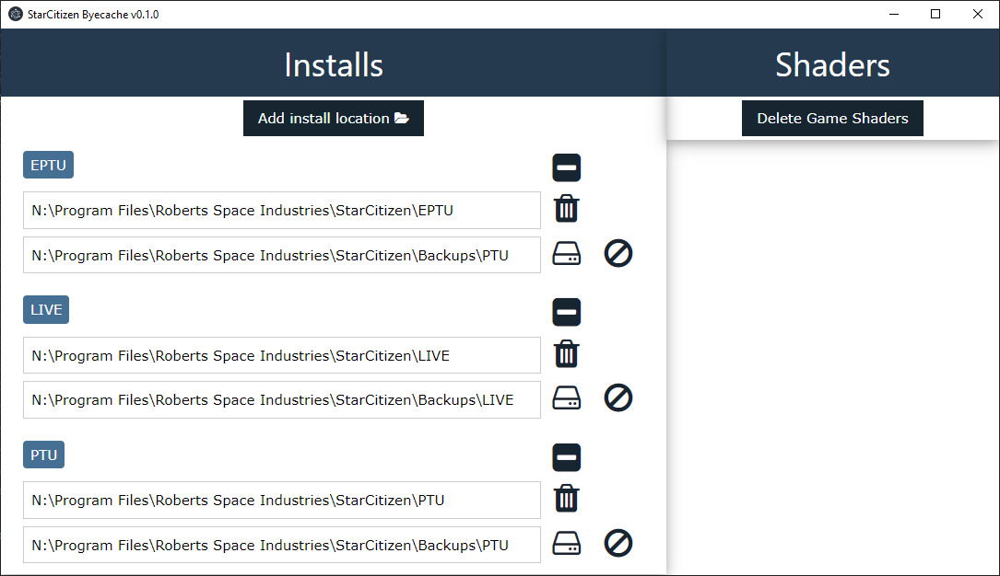

# starcitizen-byecache

Easily delete StarCitizen's cache folders after a version upgrade.

Supports:

- Deleting the contents of the `USER` directory for installs
- Deleting the game shaders

## Naming

Named after the beloved _iCache_. 

## Usage

See [usage](./docs/USAGE.md) for detailed instructions.