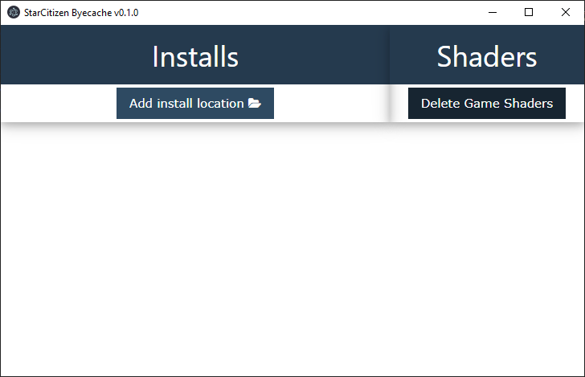
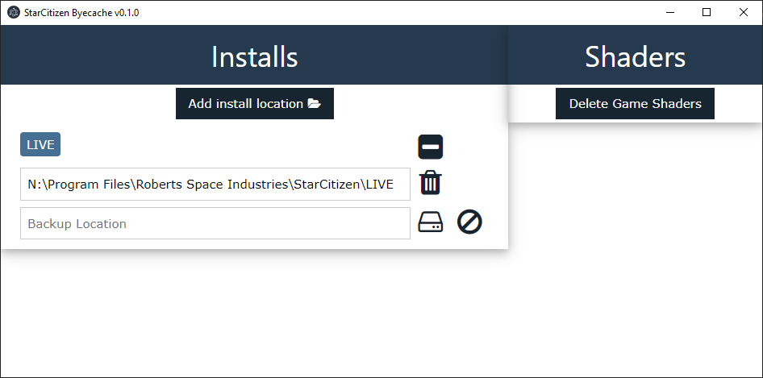
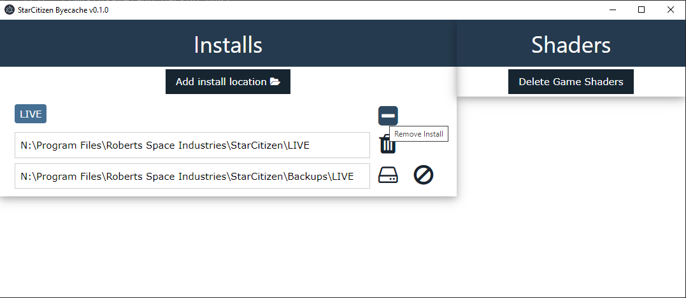
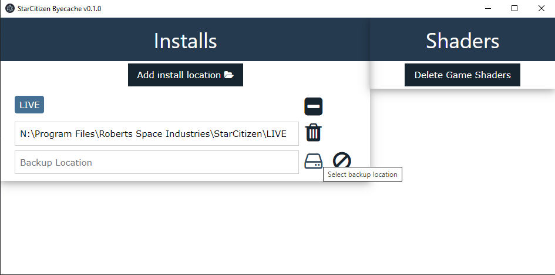
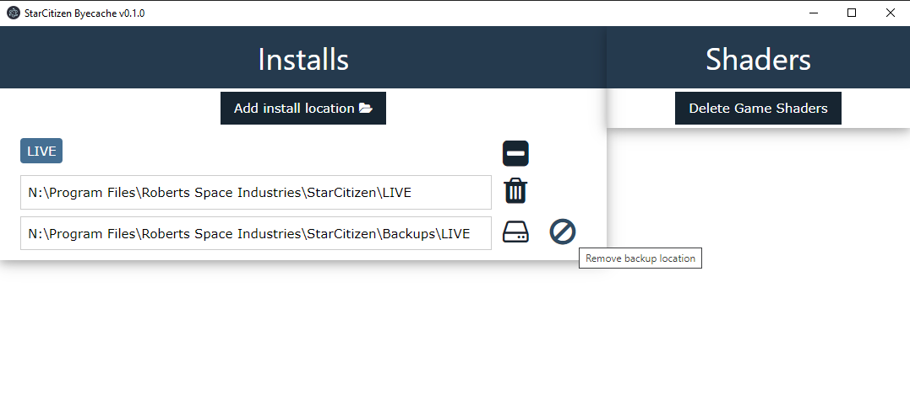
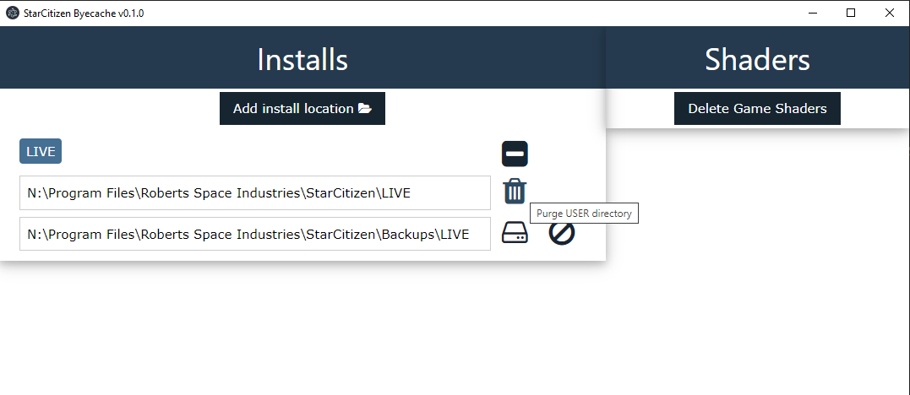
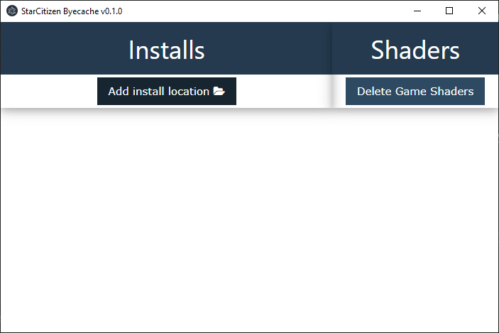

# Usage

## Install Locations

An install location is a path to a StarCitizen environment folder, e.g. `C:\Program Files\Roberts Space Industries\StarCitizen\LIVE`.

### Add Location

1. Add a new location by specifiying it with the File Browser

2. The location should be the parent of the `USER` directory

3. You can remove the location by selecting the "Remove install" button
 

### Backup Mappings

Byecache can save your client mappings found on `USER/Client/0/Controls/Mappings` prior to purging the `USER` directory.

1. Add a backup location by clicking the "Select backup location" button

2. You can always remove it with "Remove backup location"

### Purge User Directory

1. Clean your `USER` directory by clicking the "Purge USER directory" button

## Shaders

Byecache can also delete the StarCitizen shader's directory: `%localappdata%\Star Citizen`

### Game Shaders

1. Click the "Delete Game Shaders" to delete your shaders directory

